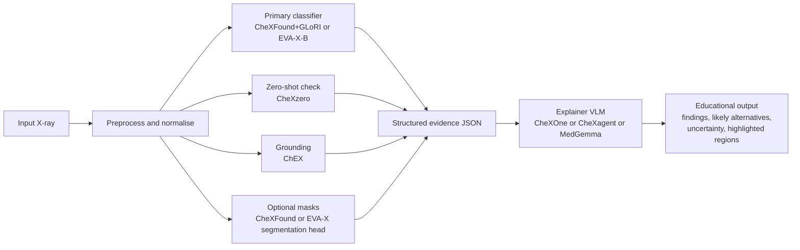

# Open-Source X-ray Vision and Vision-Language Models for an Educational First-Pass Judgement Pipeline

## Executive summary

The open, genuinely usable, recent ecosystem is overwhelmingly **chest X-ray** rather than general plain-film radiography. That is not an accident: the best open benchmarks, training corpora, and official open weights are concentrated around chest radiography, while newer multi-anatomy X-ray foundation models remain much rarer and often depend on private pretraining data. A recent example is XR-0, which reports broad multi-anatomy performance but is pretrained on a large private dataset, so it is not yet the same kind of practical open-weight option as the chest-focused models below. citeturn33search4turn30view0

For a **practical educational stack today**, the strongest open choices are these. For **vision-only judgement**, use **CheXFound + GLoRI** or **EVA-X-B** as your main chest encoder, with **CheXzero** as a zero-shot second opinion. For **localisation / “show me where”**, use **ChEX**, which is unusual in being both localised and interactive. For **natural-language explanation**, use **CheXOne**, **CheXagent-2-3b**, or **MedGemma 1.5 4B** as the explainer layer. If you want the simplest robust chain, the best current starting point is: **CheXFound+GLoRI → ChEX → CheXOne or MedGemma**. citeturn35view0turn36view2turn28view1turn23view0turn15view2turn40view2turn42search1turn43search0

A second point matters. “SOTA” numbers in this space are often **not directly comparable** because papers use different splits, different post-processing, different label ontologies, and sometimes different evaluation protocols. The ChEX authors explicitly note that exact comparisons are limited because test splits and pre/post-processing differ across models, and the same warning applies more broadly across CXR work. So the table below is best read as a **decision aid for building a stack**, not as a single global ranking. citeturn13view2

## What is actually state of the art and usable

The recent open models fall into two rather different classes. The first class is **vision-centric encoders**: they are strong at pathology prediction, representation learning, and downstream fine-tuning for segmentation or other tasks, but they do not themselves produce careful narrative explanations. The second class is **vision-language models**: they can answer questions, draft findings, produce localised descriptions, or ground report text, but they are not always the strongest raw classifier. In practice, the best educational pipeline uses **both**. citeturn23view0turn28view1turn35view0turn37view1

Among the vision-centric models, **CheXFound** is one of the strongest recent open chest encoders if you care about broad downstream utility. It is pretrained via self-distillation on roughly 987k public CXRs from 12 datasets and then adapted with the **GLoRI** head to combine global and disease-specific local features. On internal and out-of-distribution tasks it posts very strong numbers, including **0.209 AUPRC / 0.799 AUROC** on CXR-LT24 with a linear probe, **0.265 / 0.840** with GLoRI, **0.749 AUROC** for CVD-risk estimation, **0.786 AUROC** for all-cause mortality on PLCO, and **Dice 0.793** on rib segmentation. citeturn34view0turn35view0turn35view1turn36view2

**EVA-X** is the strongest open **pure image-only** chest foundation model I found with good official code and weights across multiple sizes. It is pretrained only on public chest radiographs and reports SOTA-style representation performance on ChestX-ray14, with **82.4 mAUC** for EVA-X-Ti, **83.3** for EVA-X-S, and **83.5** for EVA-X-B. It also transfers well to segmentation, with reported Dice scores of **95.49%** for lung segmentation, **54.51%** for pneumonia masks, **60.27%** for pneumothorax masks, and **60.10%** for tuberculosis masks in its transfer experiments. citeturn28view0turn28view1turn29view0turn29view1turn30view0

**CheXzero** is older but still important because it remains a clean, open, zero-shot baseline. It was trained on MIMIC-CXR image–report pairs without explicit pathology labels, uses a **ViT-B/32** image encoder, resizes inputs to **224×224**, and reports a **mean AUROC of 0.889** on the CheXpert test set without explicit labels. On PadChest, it reported **AUC ≥ 0.900 on 6 findings** and **AUC ≥ 0.700 on 38 of 57 findings**. That makes it especially useful as a “does a second, independent image–text model broadly agree?” check in a chained educational pipeline. citeturn21view0turn23view0

**ChEX** occupies a useful middle ground: it is not a chat VLM in the modern sense, but it is one of the most useful open models for *interactive, localised chest X-ray explanation*. It can take textual pathology prompts or boxes and respond with boxes plus region descriptions. In the official ECCV paper it reports **mAP 14.12 on VinDr-CXR**, **11.14 on NIH8**, **16.60 on MS-CXR** for pathology detection, and **AUROC 82.33** on MS-CXR region classification, while also supporting region explanation and report generation. That makes it unusually suitable as the *grounding* tool in front of a general explainer such as MedGemma or CheXOne. citeturn11view0turn15view2

Finally, **CheXficient** is very recent and conceptually interesting because it shows that **active data curation during pretraining** can beat brute-force scaling. It uses a CLIP-style image–text setup, trains on only **22.7% of 1,235,004** public CXR image–report pairs while consuming **under 27.3%** of the full compute budget, and still matches or exceeds its full-data counterpart across **20 benchmarks** spanning zero-shot classification, retrieval, segmentation, disease prediction, and report generation. I would classify it as a very strong research-grade option for developers who want a modern open image–text backbone and are comfortable with a newer codebase. citeturn37view0turn37view1turn38view4

## Comparative table of vision models

| Model | Task(s) | Body-part specialisation | Training data | Representative reported metrics | Size / framework | Input resolution | Inference notes | Licence | Official repo / weights | Chaining notes |
|---|---|---|---|---|---|---|---|---|---|---|
| **CheXzero** | Zero-shot classification; weak localisation via similarity maps | Chest | MIMIC-CXR paired images + report impressions | Mean **AUROC 0.889** on CheXpert test; PadChest **AUC ≥0.9 on 6 findings**, **≥0.7 on 38/57 findings** | ViT-B/32 image encoder + 63M text transformer; PyTorch | **224×224** | Lightest of the strong models here; GPU preferred, CPU feasible for low-throughput use | **MIT** | Official GitHub + checkpoints in repo README citeturn21view0turn23view0 | Excellent as a second-opinion score generator to feed into MedGemma / CheXOne prompts |
| **EVA-X-Ti** | Classification backbone; segmentation transfer | Chest | Public chest data from **ChestX-ray14 + CheXpert + MIMIC-CXR**; unlabeled-image pretraining | **82.4 mAUC** on ChestX-ray14 transfer benchmark | **6M** params; ViT-Ti/16; PyTorch / timm | Pretraining uses **336** resize then **224** crop; downstream classification at **224** | Very manageable GPU footprint; practical single-GPU model | Repo has code and weights; a clear SPDX licence is not surfaced on the parsed GitHub page, so treat reuse terms as needing verification | Official GitHub + Hugging Face downloads citeturn24view0turn30view0turn29view0 | Good low-cost visual encoder if you want fast classification before a VLM explainer |
| **EVA-X-S** | Classification backbone; segmentation transfer | Chest | Same EVA-X public chest pretraining corpus | **83.3 mAUC** on ChestX-ray14 | **22M** params; ViT-S/16; PyTorch / timm | Same as above | Strong balanced option | Same caveat on licence visibility | Official GitHub + weights citeturn24view0turn28view0turn29view0 | Very good default if you want open weights without jumping to heavier encoders |
| **EVA-X-B** | Classification backbone; segmentation transfer | Chest | Same EVA-X public chest pretraining corpus | **83.5 mAUC** on ChestX-ray14; family transfer reports Dice **95.49%** lungs, **54.51%** pneumonia, **60.27%** pneumothorax, **60.10%** TB | **86M** params; ViT-B/16; PyTorch / timm | Same as above; segmentation transfer at **512** | Best EVA-X variant; GPU strongly preferred | Same caveat on licence visibility | Official GitHub + weights citeturn24view0turn28view0turn28view3turn29view1 | Strong primary image encoder if you want one backbone for both classification and segmentation heads |
| **CheXFound** | Classification backbone; segmentation backbone; OOD risk estimation | Chest | **CXR-987K** from **12 public datasets**; ViT-L self-distillation | Linear probe on CXR-LT24: **AUPRC 0.209 / AUROC 0.799**; PLCO **AUROC 0.749** CVD-risk, **0.786** all-cause mortality; segmentation Dice **0.793** on VinDr-RibCXR and **0.980** on Montgomery | **ViT-L/16**; PyTorch 2.0 + xFormers | Official examples use **512×512** high-res pretraining / eval | Heavier than EVA-X; best treated as GPU model | No SPDX licence is surfaced on the parsed repo page; verify before redistribution | Official GitHub + weights / notebook via Google Drive citeturn31view0turn35view0turn35view1turn36view2 | One of the best “foundation encoder” choices for a serious educational stack |
| **CheXFound + GLoRI** | Classification with local feature integration | Chest | Same CheXFound backbone + GLoRI head | On CXR-LT24 **AUPRC 0.265 / AUROC 0.840**; on CheXpert **AUROC 0.908** | ViT-L backbone + light attention head; PyTorch | **512×512** in official eval commands | GPU-preferred; still practical compared with large VLMs | Same licence caveat as base model | Official GitHub + notebook / checkpoints citeturn31view0turn35view0 | Best single “judge” row in this report if you want raw prediction quality rather than prose |
| **ChEX** | Prompted pathology detection, sentence grounding, region classification, localised explanation, report generation | Chest | MIMIC-CXR + Chest ImaGenome + VinDr-CXR | Detection mAP: **14.12** VinDr-CXR, **11.14** NIH8, **16.60** MS-CXR; region classification **AUROC 82.33** on MS-CXR, **wAUROC 70.46** on CIG | Uses CheXzero encoders plus DETR-style detector + sentence generator; PyTorch | **224×224** | GPU recommended; checkpoint available | **MIT** | Official GitHub + stage-3 checkpoint citeturn11view0turn15view2 | Best open localisation module to turn raw scores into “where is the finding?” evidence for a VLM |
| **CheXficient** | Zero-shot classification, retrieval; downstream disease prediction, segmentation, report generation after adaptation | Chest | **1.235M** public image–report pairs from **13 datasets**; active curation retains **280K** pairs | Using only **22.7%** of data and **<27.3%** compute, it matches or exceeds its full-data counterpart across **20 benchmarks**; saves **72.7–81.8%** of H100 GPU-hours vs full-data pretraining | CLIP-style image–text model; PyTorch + Transformers | Uses configurable `image_size`; official code resizes / crops to model size | Research-grade; GPU expected | **MIT** | Official GitHub + pretrained checkpoints via Google Drive / Hugging Face citeturn37view0turn37view1turn38view4 | Strongest “modern CLIP-style” backbone in this list if you want an image–text encoder to sit under your own heads |

A short practical note on segmentation. If your educational workflow genuinely needs masks, the most convincing open routes in this shortlist are **CheXFound** and **EVA-X** with downstream segmentation heads, rather than a chest-specific standalone segmentation model with equally strong official open release quality. CheXFound reports **Dice 0.793** for individual rib segmentation on VinDr-RibCXR and **0.980** for lung segmentation on Montgomery; EVA-X reports very strong transfer Dice across lung and abnormality masks. citeturn36view2turn28view3

## Comparative table of radiology-capable vision-language models

| Model | Task(s) | Body-part specialisation | Training data | Representative reported metrics | Size / framework | Input resolution | Inference notes | Licence | Official weights / repo | Chaining notes |
|---|---|---|---|---|---|---|---|---|---|---|
| **CheXagent-2-3b** | Chest-X-ray VLM: report drafting, VQA, multimodal interpretation | Chest | **CheXinstruct**, curated from **28 public datasets**; evaluated on **CheXbench** | Official project reports CheXagent outperforms prior general and medical FMs on CheXbench by **up to 97.5%**; reader study reports **36%** time saving for residents, and writing efficiency improved in **81%** of resident and **61%** of attending cases | **3B** params; Transformers / Safetensors; vLLM and SGLang examples provided | Current public card does **not clearly surface** a single training resolution | Realistically a single modern GPU model; official card shows `device_map="auto"` and vLLM serving | **Current HF page shows MIT**; older model-card revision showed **CC-BY-NC-4.0**, so verify the current card before reuse | Official HF + GitHub + project page citeturn42search1turn41search0turn41search1turn41search2turn41search3turn42search4 | Good direct explainer if you want a chest-specific VLM rather than a general medical one |
| **CheXOne** | Reasoning VLM for report generation, VQA, visual grounding | Chest | Chest-X-ray post-training on **Qwen2.5-VL-3B-Instruct** | Official card says it **matches or outperforms resident-drafted reports in 55% of cases** and supports both **reasoning** and **instruct** modes | Based on **Qwen2.5-VL-3B-Instruct**; Transformers | Official card recommends `max_pixels=512*512` at inference to match training | Single-GPU friendly by design; official card recommends FlashAttention 2 and `device_map="auto"` | **CC-BY-NC-4.0** | Official Hugging Face card and GitHub links in card citeturn40view2 | Probably the best open-weight chest reasoning explainer for an educational front end, especially if you want grounded narrative output |
| **MedGemma 1.5 4B IT** | General medical multimodal chat / explanation | Multi-modality medical images including radiology; not chest-only | Official cards describe a medical image–text model intended as a **starting point** for downstream healthcare applications; Google’s January 2026 release positions **MedGemma 1.5 4B** as the updated image-interpretation model | Public official snippets emphasise breadth and intended use rather than a single chest-X-ray benchmark number; Google states it is for downstream adaptation rather than turnkey diagnosis | **4B** multimodal; based on Gemma-family decoder-only architecture | Public snippets here do not expose a single canonical resolution | Best thought of as the *explainer/orchestrator* rather than the first-line detector; manageable compared with 27B models | Open Google / Gemma-family model card terms; **verify the live HF card** before redistribution | Official HF model page; Gemma landing page announces MedGemma 1.5 4B citeturn43search0turn43search3turn43search10turn43search16 | Best option when you want one general medical explainer to sit on top of stronger task-specific X-ray tools |
| **MedGemma 27B IT** | Larger general medical multimodal chat / explanation | Multi-modality medical images including radiology | Same MedGemma family positioning as above | No chest-specific benchmark surfaced in the accessible official snippet; use as a larger reasoning / explanation model, not as your only judge | **27B** multimodal | Public snippet does not expose a single canonical resolution | By inference from size, this is a multi-GPU or aggressive-quantisation model for most users | Verify live HF card / Gemma terms | Official HF page citeturn43search2turn43search3 | Use only if you want heavier explanation / synthesis after your specialist vision models have already done the real work |

One important judgement call: if your goal is a **first educational reading of a chest X-ray**, the chest-specialised VLMs above are usually more appropriate than a general medical chat model. **MedGemma** becomes most useful when you need a broader medical interface or want one common explainer layer across several healthcare modalities. By contrast, **CheXOne** and **CheXagent** are narrower but better matched to chest-radiograph language and workflow. citeturn43search0turn40view2turn41search1

## Integration guide

A sensible educational pipeline is not “one giant model looks at the image and tells me the truth”. The better design is **tool use**: one model scores likely findings, one grounds them, one optionally segments anatomy or lesions, and only then does a VLM turn those machine outputs into constrained prose.



### A minimal practical stack

If you want the **least fussy strong baseline**, use **CheXFound+GLoRI** for the main pathology scores, **ChEX** for boxes and region descriptions, and **CheXOne** for final wording. That gives you one high-quality classifier, one localiser, and one interpretable language layer. CheXFound is the strongest raw vision pick in this report for broad chest tasks, ChEX adds grounding, and CheXOne is explicitly built for chest reasoning and grounding. citeturn35view0turn36view2turn15view2turn40view2

If you want a **lighter stack**, use **EVA-X-S** or **EVA-X-B** as the visual encoder, **CheXzero** as the second-opinion zero-shot scorer, and **MedGemma 1.5 4B** as the explainer. This is less chest-language-specific at the explanation stage, but it is cleaner if you already want to standardise on MedGemma for other medical-image tasks. citeturn28view0turn23view0turn43search0

If you want a **research-heavy image–text backbone** and are comfortable with newer tooling, replace CheXFound/EVA-X with **CheXficient**, especially if you care about active-curation pretraining, retrieval, or studying efficient CLIP-style chest encoders. citeturn37view0turn37view1turn38view4

### Preprocessing that is worth doing

Use the same obvious radiograph hygiene every time: preserve laterality and orientation, handle grayscale correctly, respect AP/PA/lateral metadata where available, avoid aggressive histogram operations that could alter subtle findings, and ensure your resize path matches the target model family. The official models here are mostly trained around **224** or **512** windows, with **EVA-X** pretraining using 336-resize then 224-crop and segmentation transfer at 512, while **CheXFound** uses 512 high-resolution pretraining / evaluation commands and **CheXOne** explicitly recommends a **512×512** pixel budget for inference. citeturn29view0turn31view0turn40view2

### Expected intermediate outputs

Do not pass raw logits straight into a VLM and ask it to “diagnose”. Pass a **small structured evidence object** instead. In practice that means a JSON-like package containing the image ID, quality flags, view position, top finding scores, any grounded boxes, and any masks. For example:

```json
{
  "view": "PA",
  "quality": {"rotation_ok": true, "exposure_ok": true, "ood_flag": false},
  "scores": {
    "pleural_effusion": 0.83,
    "cardiomegaly": 0.71,
    "pneumothorax": 0.08
  },
  "boxes": [
    {"label": "pleural_effusion", "x1": 0.08, "y1": 0.64, "x2": 0.41, "y2": 0.95}
  ],
  "masks": ["left_lung_mask", "right_lung_mask"],
  "agreement": {
    "chexfound_glori": ["pleural_effusion", "cardiomegaly"],
    "chexzero": ["pleural_effusion"],
    "chex": ["pleural_effusion"]
  }
}
```

That lets the language model act as an **explainer and aggregator**, not as the sole perceptual engine.

### Prompts that are less likely to go wrong

A good explainer prompt is narrow, explicit, and uncertainty-aware. Something like this works well:

```text
You are an educational chest-radiograph explainer.
Use the image and the structured evidence only.
Do not claim a clinical diagnosis.
Write:
1. likely visible findings,
2. what image regions support them,
3. plausible alternatives,
4. uncertainty and what could make the judgement wrong,
5. what a student should verify manually.
If evidence conflicts, say so explicitly.
```

For **CheXOne**, use its reasoning mode only when you want the model’s explicit chain-like rationale; use instruct mode for faster plain findings text. For **MedGemma**, the prompt should explicitly tell it that the detector/localiser outputs are higher-priority evidence than its own unconstrained impressions, because MedGemma is broader and less chest-specific than CheXOne or CheXagent. citeturn40view2turn43search0

## Evaluation caveats, ethics, and open questions

The first caveat is methodological. These models are often measured on different tasks, different ontologies, and different label sources. Some labels come from radiologists, others from report parsers; some papers measure AUROC, others AUPRC, mAP, Dice, region-F1, or report metrics such as RadGraph. ChEX explicitly warns that exact comparisons across models are limited by different test splits and preprocessing. So your own evaluation should be **task-specific**: a classifier should be checked for calibration and subgroup stability; a localiser should be checked for box plausibility; a VLM should be checked for hallucinations and contradiction handling. citeturn13view2turn15view0

The second caveat is external validity. Official cards themselves are blunt about limited validation. Google’s CXR Foundation card notes that the model was trained on de-identified data from the **US and India**, may not generalise well to other countries or manufacturers, and has been validated only on a limited subset of possible downstream chest-radiography tasks. CheXagent’s project page also includes a fairness evaluation over sex, race, and age, which is useful precisely because subgroup disparities are plausible here, not hypothetical. citeturn19search8turn20search5turn41search0

The third caveat is legal and ethical. Several of these model releases are explicitly **for research** or as **starting points**, not clinical products. The CheXagent repo states that the repository and models are for **research purposes only and not for clinical use**. MedGemma’s official card likewise says it is a starting point for downstream healthcare applications and that developers are responsible for adapting it for any intended use. For your stated goal — educational first judgement only — that is exactly the right posture. Anything beyond that would require proper device, governance, privacy, and validation work. citeturn41search3turn43search0turn43search2

There is also a licence caveat. In this ecosystem, **code licence**, **weights licence**, and **training-data access terms** often differ. CheXzero and ChEX are straightforwardly MIT on the repo side; CheXficient’s repo is also MIT. CheXagent is less tidy in the currently visible public artefacts because the live Hugging Face page currently shows one licence state while an earlier model-card revision showed another. For any real reuse or redistribution, you should verify the *current* model page and the weights card directly before packaging it into a public application. citeturn21view0turn11view0turn37view0turn42search1turn42search4

### Open questions and limitations

The main limitation of this report is structural, not accidental: **open, official, recent, well-benchmarked plain-film models outside chest radiography are still comparatively scarce**. That is why the shortlist is chest-heavy. Recent multi-anatomy X-ray work exists, but the most ambitious examples rely on private pretraining data rather than practical open-weight releases. citeturn33search4

A second limitation is that some official cards do not surface every implementation detail cleanly in machine-readable public snippets, especially **input resolution** and sometimes **licence terms** for particular checkpoints. Where that happened, I have said so rather than guessing. The safest workflow is to use the tables above as a **shortlist**, then verify the exact current repo / model-card terms before building your environment. citeturn40view0turn43search0turn31view0

The bottom line is simple. If you want a defensible educational pipeline **today**, build around **CheXFound+GLoRI or EVA-X-B** for perception, **ChEX** for localisation, and **CheXOne or MedGemma** for constrained explanation. That is the clearest route to a first-pass X-ray judgement system that is open enough to run, recent enough to matter, and modular enough not to collapse into a single opaque black box. citeturn35view0turn28view1turn15view2turn40view2turn43search0